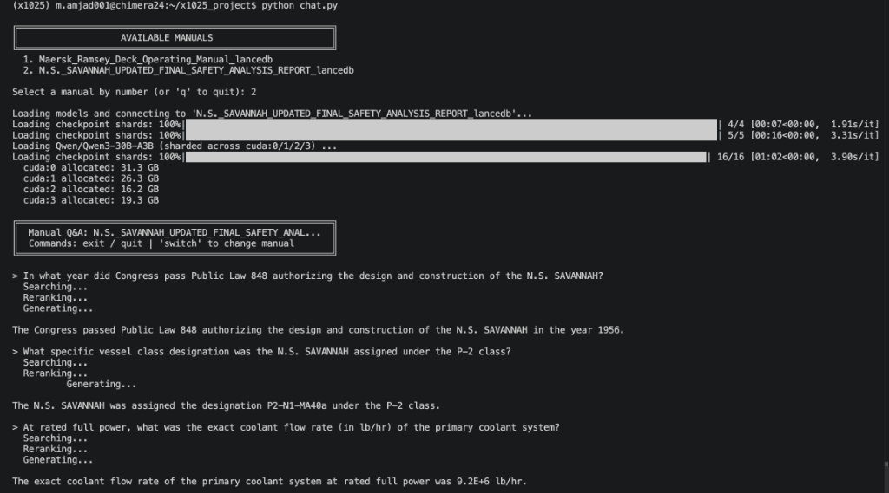
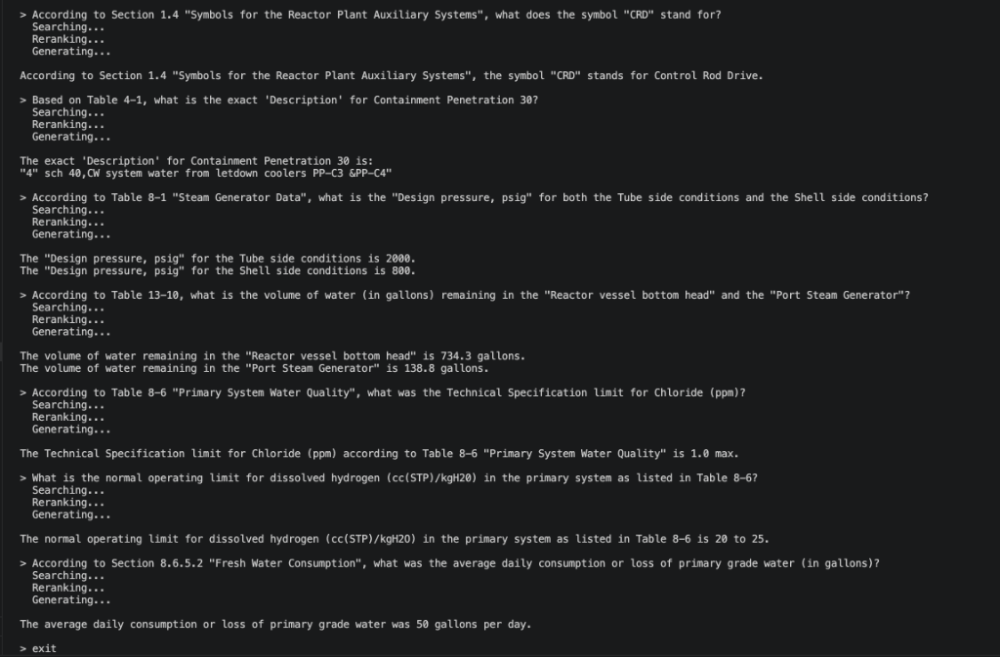

# x1025-maritime-rag — Autonomous Maritime Intelligence
**Layer 1 Prototype: Industrial-Grade RAG for Complex Engineering Documents**

Welcome to the foundational AI infrastructure for **x1025-maritime-rag**. This repository contains a production-grade Retrieval-Augmented Generation (RAG) pipeline built to ingest, search, and reason over highly technical maritime engineering manuals, such as the *N.S. SAVANNAH Safety Analysis Report*.

Standard "out-of-the-box" RAG systems fail spectacularly on dense, multi-page maritime documents. This prototype was explicitly engineered to solve those failures, providing 100% grounded answers to complex procedural and tabular questions without hallucinating—a critical safety requirement under the ISM Code.

## 🚀 Key Architectural Innovations

* **Macro-Chunking:** Instead of naive line-splitting, we group text under shared Markdown headers up to a strict `1000` word limit, with a 5-line overlap on splits. This ensures large tables are ingested as single, cohesive units, preventing the fragmentation of rows from their column headers.
* **Vision-Language Processing (VLM):** We bypass faulty OCR and extract pristine native text via Docling. For diagrams, we use quantized **InternVL2.5-38B-AWQ** to dynamically translate imagery into highly accurate text descriptions, which are then embedded directly back into the Markdown source.
* **Three-Stage Hybrid Retrieval & Generation:**
  * **Stage 1 (Recall):** `LanceDB` hybrid search combining `NV-Embed-v2` cosine similarity with BM25, fused via Reciprocal Rank Fusion, fetches up to 100 candidates.
  * **Stage 2 (Precision):** A `Qwen3-Reranker-0.6B` cross-encoder scores each candidate via yes/no logits and extracts the top-N most relevant chunks.
  * **Stage 3 (Synthesis):** A locally-hosted `Qwen3.6-35B-A3B` (Q6_K GGUF, ~29 GB) generates a strictly grounded answer over the reranked context, with thinking mode disabled for deterministic output.
* **Multi-Slice GPU Orchestration:** Embedder, reranker, and generator are pinned to separate MIG slices. The LLM runs in an isolated child subprocess because `llama.cpp` dedupes devices by PCI BDF — all MIG slices share one BDF, so single-slice pinning only works when the slice is the only one visible to the process.
* **100% Self-Hosted Security:** Designed specifically to run on local **NVIDIA H200 MIG slices**. No sensitive fleet data or proprietary company manuals are ever sent to third-party APIs like OpenAI.

## 💻 Hardware Requirements

This is an enterprise-grade pipeline designed for heavy GPU computation.
* **Minimum Requirement:** 3x NVIDIA H200 MIG slices (each ~`1g.35gb`, ~34.9 GB VRAM), or equivalent GPUs with combined ~105 GB of VRAM.
* **Slice layout at runtime:**
  * `cuda:0` — NV-Embed-v2 (~15.7 GB) [parent process]
  * `cuda:1` — Qwen3-Reranker (~16.4 GB) [parent process]
  * slice 2 — Qwen3.6-35B-A3B Q6_K (~28-30 GB) [child subprocess, single-slice pinned]
* **Why three slices?** llama.cpp's BDF deduplication forces the LLM into a process where only one MIG slice is visible. Override the slice index with `LLM_MIG_UUID` if needed.
* **Slurm:** request `--gres=gpu:3` minimum.

## ⚙️ Installation & Setup

We have provided Conda environments capturing the exact working state.

```bash
# Clone the repository
git clone https://github.com/Moiz-Amjad/x1025-maritime-rag.git
cd x1025-maritime-rag

# Create the Conda environment from the exported file
conda env create -f environment.yml

# Activate the environment
conda activate x1025
```
*(Note: If you are building on a different architecture, you can use `requirements.txt` to install dependencies without OS-specific hashes).*

`llama-cpp-python` must be built with CUDA support for the generation stage:
```bash
CMAKE_ARGS="-DGGML_CUDA=on" pip install llama-cpp-python --no-cache-dir \
    --force-reinstall --no-binary=llama-cpp-python
```

Copy `.env.example` to `.env` and configure your `HF_HOME` and `HF_TOKEN` so HuggingFace models download to your designated persistent cache (the first run pulls ~80 GB of weights across all stages).

## 🚀 Quickstart Guide

The pipeline executes in two distinct phases: **Ingestion** (run once per document) and **Retrieval / Generation** (interactive or one-shot).

### Phase 1: Data Ingestion & Indexing
Place your raw PDF in the `data/` directory, then run the three extraction scripts in order:

1. **PDF to Markdown:** Converts raw PDFs into structured Markdown using Docling, saving complex figures as PNGs and emitting `manual.md` + `image_manifest.json`.
   ```bash
   python src/convert_to_markdown.py data/<file-name>.pdf --output-dir data/<output-dir>
   ```
2. **Vision Extraction:** Uses InternVL2.5-38B-AWQ to analyze extracted images, writes descriptions back into both the manifest and `manual.md` in a single pass.
   ```bash
   python src/describe_images_lmdeploy.py data/<output-dir>
   ```
3. **Embedding & Indexing:** Runs the Macro-Chunking algorithm over `manual.md`, embeds text and image-description chunks using `NV-Embed-v2`, and writes the vectors to a per-folder LanceDB table at `data/lancedb/<folder>_lancedb.lance` with an FTS index for hybrid search.
   ```bash
   python src/ingest.py data/<output-dir>
   ```

### Phase 2: Querying & Generation

**Interactive chat (recommended):** Loads all three models once and keeps them warm across queries. Lets you switch between manuals without reloading.
```bash
python src/chat.py
```
Inside the chat: type a question, `switch` to pick a different manual, or `quit` / Ctrl+D to exit.

**One-shot CLI:** Useful for scripted evaluation or single questions.
```bash
python src/answer.py data/lancedb/<folder>_lancedb.lance "your question here"
```

**Retrieval-only (no generation):** Inspect the reranked chunks without spinning up the LLM.
```bash
python src/retrieve.py data/lancedb/<folder>_lancedb.lance "your query"
```

## 🎯 Performance Demonstration

The pipeline has been extensively tested against the *N.S. SAVANNAH Safety Analysis Report*. By combining Macro-Chunking with a cross-encoder reranker and a strictly-grounded generator, the system successfully extracts and synthesizes correct answers from highly complex, tabular engineering data where standard RAG systems fail.




## 🛠 Engineering "War Stories"
Building this pipeline involved solving several critical limitations of modern LLMs and toolchains:
* **Token Truncation:** We discovered embedding models natively amputated the bottom 200 tokens of 1500-word chunks. We mathematically fixed this by reducing chunk thresholds to 1000 words.
* **NV-Embed-v2 Patches:** The upstream `modeling_nvembed.py` had multiple incompatibilities with current `transformers` (rotary embeddings not threaded through gradient checkpointing, KV-cache tensor handling). `ingest.py` patches the cached file in-place on first load — see `patch_nvembed()`.
* **MIG Slice Pinning for llama.cpp:** All MIG slices on an H200 share a single PCI BDF, which `llama.cpp` deduplicates. We isolate the LLM in a `multiprocessing.spawn` child with `CUDA_VISIBLE_DEVICES` pinned to a single slice UUID — the only reliable way to run llama.cpp on one MIG partition while the parent uses the others.
* **Ground Truth Discrepancies:** When the LLM supposedly "failed" test queries, we wrote programmatic PDF-extraction scripts that proved the LLM was actually 100% correct — the expected test answers were factually missing from the original source documents.

---
*Developed for the IMPACT Program — UMass Boston Venture Development Center*
